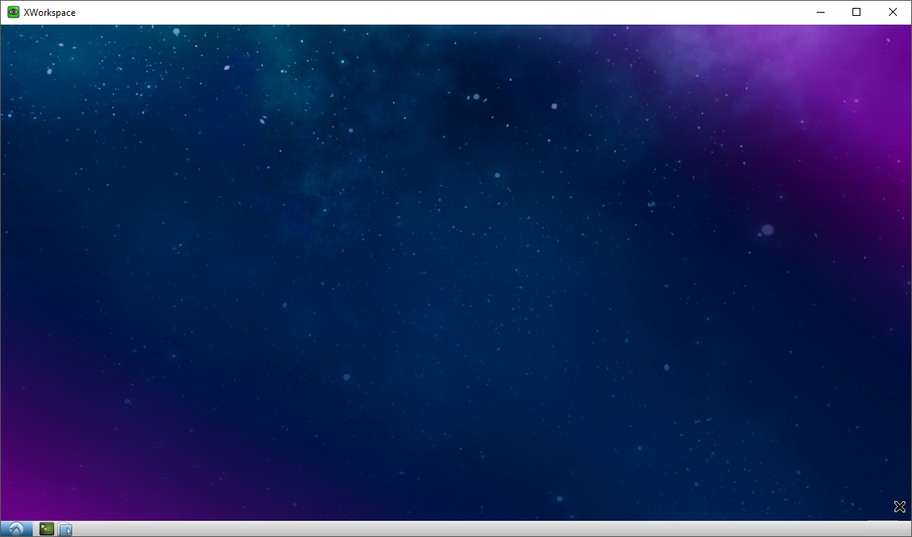

# XWorkspace #
[](https://travis-ci.org/ashenm/xworkspace) [](https://hub.docker.com/r/ashenm/xworkspace/)



## INDEX ##

* [Usage](#usage)
  * [Using `xworkspace`](#using-xworkspace)
  * [Using `scripts/run.sh`](#using-scriptsrunsh)
    * [Directory Mounts](#directory-mounts)
    * [Git Configuration](#git-configuration)
    * [SSH Configuration](#ssh-configuration)
    * [Working Directory](#working-directory)
    * [Exposed Ports](#exposed-ports)
    * [Custom Image](#custom-image)
    * [Custom Command](#custom-command)
* [Compatibility](#compatibility)
  * [`scripts`](#scripts)

## USAGE ##

A docker container spawned utilising `scripts/run.sh` with no additional arguments will expose VNC service on host's port _5050_ without authentication.

A VNC client of preference can then be used to initiate a remote session to the spawned container. For instance, the following command initiate a remote session without frame compression using _[TurboVNC](https://turbovnc.org)_.

```shell
vncviewer --nojpeg --compresslevel 0 localhost:5050
```

### Using `xworkspace` ###

The `xworkspace` executable located at `/usr/local/sbin` facilitates ease administration of the VNC Server.

The default behaviour of `xworkspace` can be altered by providing [Xvnc4](https://archive.realvnc.com/products/vnc/documentation/4.1/unix/man/Xvnc.html) compatible arguments. For instance, the following command overrides the resolution (default _1024x768_) and the VNC service port (default _5050_).

```shell
xworkspace -rfbport 8080 -geometry 1366x768
```

The above behaviour of `xworkspace` can be utilised in conjoin with `scripts/run.sh`'s [custom command](#custom-command) feature to spawn a customised container. For example, the following command attempts to expose the VNC service with authentication.

```shell
./run.sh xworkspace -SecurityTypes VncAuth
```

### Using `scripts/run.sh` ###

#### Directory Mounts ####
###### `-m` `-v` `--mount` `--volume` ######

The option `-m` or `--mount` can be used to bind mount a host directory to a new container either using a relative or an absolute path. It will be binded at `~/workspace` on the created container.

For instance, to bind current directory run `./run.sh --m .` or `./run.sh --mount .`.

Similarly, to bind a directory like `C:\foo\bar` using an absolute path on a Windows[**\***](#compatibility) system to container's `~/workspace` run `./run.sh -m  C:\foo\bar`.

Additional volumes can be binded using multiple `-v` or `--volume` followed by respective source and destination path in standard docker format.

For instance, to bind mount directory `C:\foo\bar` at `/mnt/foo/bar` with read-only permissions run `./run.sh -v C:\foo\bar:/mnt/foo/bar:ro`.

#### Git Configuration ####
###### `--git` ######

The present of flag `--git` will bind `~/.gitconfig` on host to `~/.gitconfig` on  the container with read-only access.

#### SSH Configuration ####
###### `--ssh` ######

The present of flag `--ssh` will bind `~/.ssh` on host to `~/.ssh` on container with read-only access.

#### Working Directory ####
###### `-w` `--workdir` ######

The default working directory of the container is set to `~/workspace`. It can be overridden to suit the need by using either `-w` or `--workdir` followed by the absolute path of the desired directory.

For instance, to set `/usr/share/workspace` as the container working directory run `./run.sh -w /usr/share/workspace`.

#### Exposed Ports ####
###### `-p` `--publish` ######

The default behaviour of `run.sh` is to only publish container's exposed port _5050_ to host's _5050_ which serves as the VNC entrypoint.

The utilisation of the flag `-p` or `--publish` publishes the container's additionally exposed ports _8080_, _8081_, and _8082_ to to the host's _8080_, _8081_, and _8082_ respectively.

#### Custom Image ####
###### `--image` ######

The `run.sh` can be used to run any docker image that is intended to be run as an executable. By default, it will attempt to use [ashenm/xworkspace:latest](https://hub.docker.com/r/ashenm/xworkspace) as the image unless specified.

The default image can be overridden by simply specifying the desired image name followed by the parameter `--image`. If multiple images are specified the last most image name will be used.

For instance, the following command attempts to compose a gzip tarball from the current directory content utilising the [`alpine:latest`](https://hub.docker.com/_/alpine) image conjoining `scripts/run.sh`'s [custom command](#custom-command) feature.

```shell
./run.sh --image alpine --mount . tar czf archive.tgz .
```

#### Custom Command ####

By default, `run.sh` will attempt to execute command `xworkspace`. The default behaviour can altered by specifying a custom command as the last most argument to `run.sh`.

For example, the following command attempts to executes the python's built-in http simple server in a newly spawned container serving files in the current directory at [http://_&lt;DOCKER&lowbar;HOST&gt;_:8080]().

```shell
./run.sh --publish --mount . python3 -m http.server 8080
```

## COMPATIBILITY ##

### `scripts` ###

Given that _[Docker](https://www.docker.com/)_ is installed, the facilitator scripts provided can be used with any shell that is is *Bourne SHell* compatible.

For _Microsoft Windows_ use a POSIX-compliant run-time environment such as _MSYS_ or _Cygwin_ with _[WinPTY](https://github.com/rprichard/winpty
)_ or Microsoft's own [_Windows Subsystem for Linux_](https://docs.microsoft.com/en-us/windows/wsl/about).
